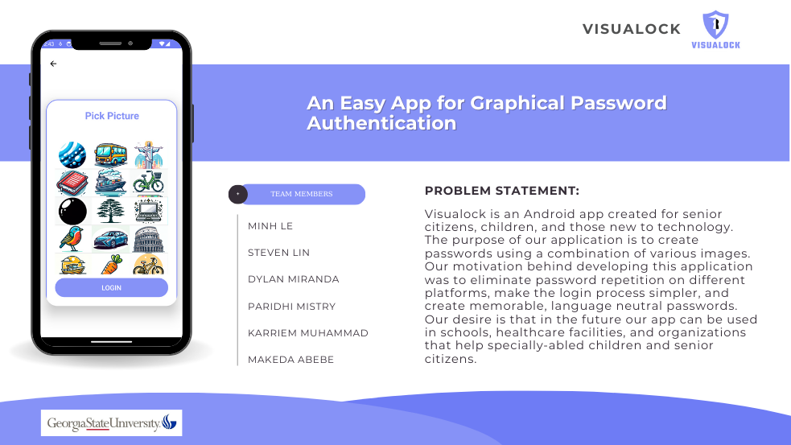

# Visualock (SWE Project)
  

## ⭐ Overview
* A password system that utilizes images as passwords instead of the traditional text-based passwords. This login method will be particularly useful for older adults or those prone to forget passwords as images can be remembered easier.

## 🌐 Web Screenshots

## ⭐ Features
* Graphical Password Authentication
* Textual Login
* Update User Name / Email / Password
* Forgot Password
* Delete Account
* Upload Images

## 💻 Tech Stacks

*  Java

* 
Firebase

